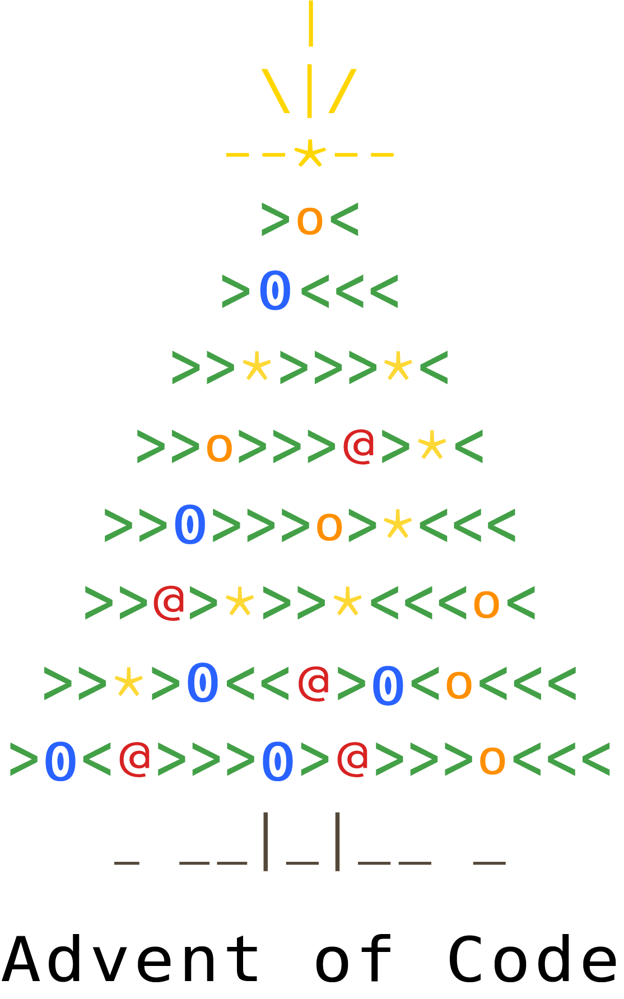

Solutions in [Python][py] for the [Advent of Code][aoc] annual programming challenge.

# 🎄🌟🌟 Advent of Code in Python 🎄🌟🌟

**Advent of Code** is an annual [Advent calendar][advent-calendar] of small programming puzzles that can be solved in any programming language, in this repository [Python 3][py] is used.

Annual editions: [2021](#-2021), [2020](#-2020-tropical-island-), [2019](#-2019-solar-system-), 2018, 2017, 2016, 2015.

# 🎄🌟 [2021](./2021/) 🎄🌟

> You're minding your own business on a ship at sea when the overboard alarm goes off! You rush to see if you can help. Apparently, one of the Elves tripped and accidentally sent the sleigh keys flying into the ocean!

| 日 | 月 | 火 | 水 | 木 | 金 | 土
|---|---|---|---|---|---|---
| - | - | - | [1](./2021/day-1) | - | - | - |

# 🎄🌟 [2020: Tropical Island](./2021/) 🎄🌟

> After saving Christmas five years in a row, you've decided to take a vacation at a nice resort on a tropical island. *Surely*, Christmas will go on without you.

Done solving all the puzzles of [Advent of Code 2020][aoc-2020]!

| 日 | 月 | 火 | 水 | 木 | 金 | 土
|---|---|---|---|---|---|---
| - | - | [1](./2020/day-1) | [2](./2020/day-2) | [3](./2020/day-3) | [4](./2020/day-4) | [5](./2020/day-5)
|[6](./2020/day-6) | [7](./2020/day-7) | [8](./2020/day-8) | [9](./2020/day-9) | [10](./2020/day-10) | [11](./2020/day-11) | [12](./2020/day-12)
|[13](./2020/day-13) | [14](./2020/day-14) | [15](./2020/day-15) | [16](./2020/day-16) | [17](./2020/day-17) | [18](./2020/day-18) | [19](./2020/day-19)
|[20](./2020/day-20) | [21](./2020/day-21) | [22](./2020/day-22) | [23](./2020/day-23) | [24](./2020/day-24) | [25](./2020/day-25) | -

# 🎄🌟 [2019: Solar System](./2019) 🎄🌟

> Santa has become stranded at the edge of the Solar System while delivering presents to other planets!

| 日 | 月 | 火 | 水 | 木 | 金 | 土
|---|---|---|---|---|---|---
| [1](./2019/day-1) | [2](./2019/day-2) | [3](./2019/day-3) | [4](./2019/day-4) | [5](./2019/day-5) | [6](./2019/day-6) | [7](./2019/day-7)
| [8](./2019/day-8) | [9](./2019/day-9) | [10](./2019/day-10) | [11](./2019/day-11) | [12](./2019/day-12) | [13](./2019/day-13) | [14](./2019/day-14) 
| [15](./2019/day-15) | - |
| - | 

# 🎄🌟 Resources 🎄🌟

* [Advent of Code subreddit](https://www.reddit.com/r/adventofcode/)
* [Red Blob Games](https://www.redblobgames.com/): interactive visual explanations of math and algorithms
* [Comprehensive walk-through](https://github.com/mebeim/aoc/blob/master/2020/README.md) by [Marco Bonelli](https://github.com/mebeim)

[aoc]: https://adventofcode.com/
[aoc-2020]: https://adventofcode.com/2020/
[advent-calendar]: https://en.wikipedia.org/wiki/Advent_calendar
[py]: https://docs.python.org/3/
